# Prerequisite

Register to IBM Cloud: https://ibm.biz/BdqMxJ 

# Step 1 : Create Jupyter Notebook on Watson 

To be able to create online Jupyter Notebook we will need to access Watson service that will provide us the environment, For this we will use Watson Studio service.
Go to: https://cloud.ibm.com/catalog/services/watson-studio
And click the "Create" button.

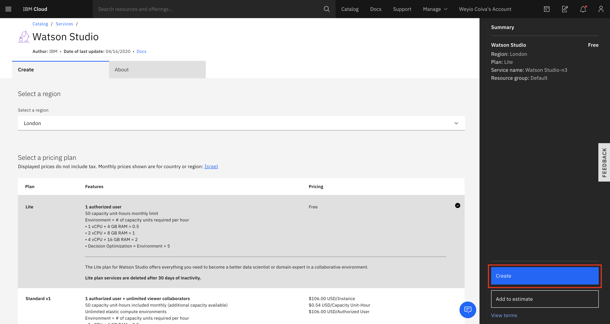

After the service has been created we can go and use its UI to create our Notebook.
Click on "Get Started"

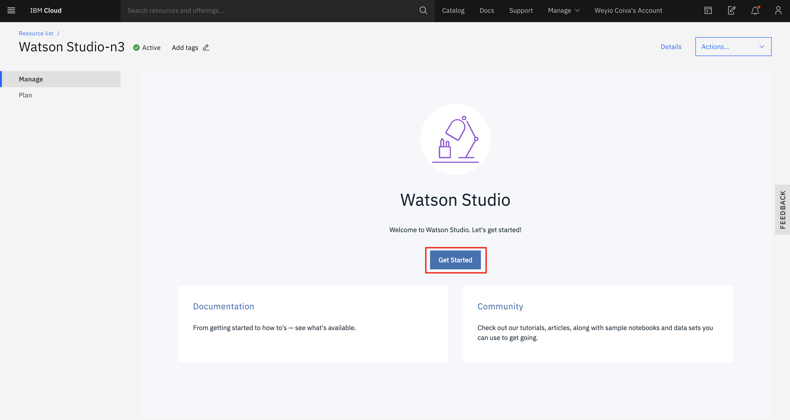

Watson Studio provide us a full environment for Data Science from the Data preparation to the Model build and also deploy the model as microservice on IBM Cloud.
So to use it we will need to create our own project to start add assest to it like Jupyter Notebook.
Click on "Create a Project"

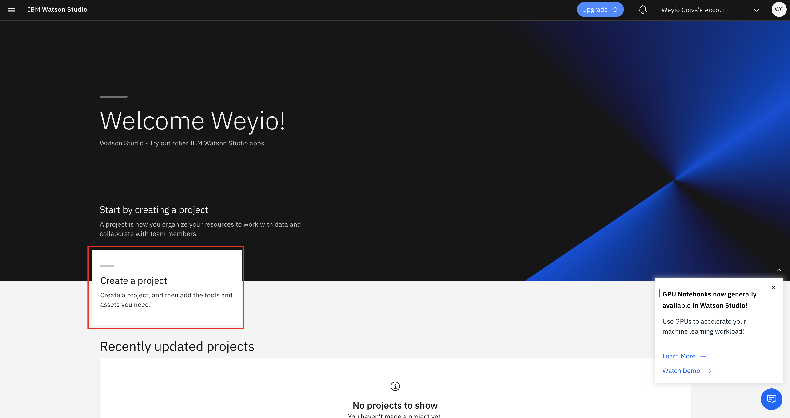

Select the "Create an empty project"

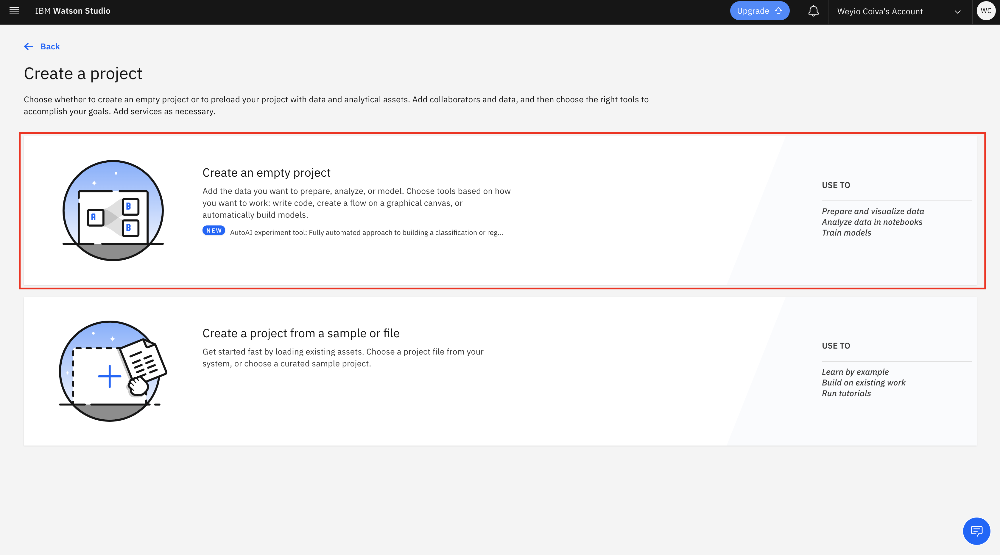

For every project we will need to attach an Object Storage where we can save our assets.
So give you project a name and attach an Object storage to it by click on "Add".

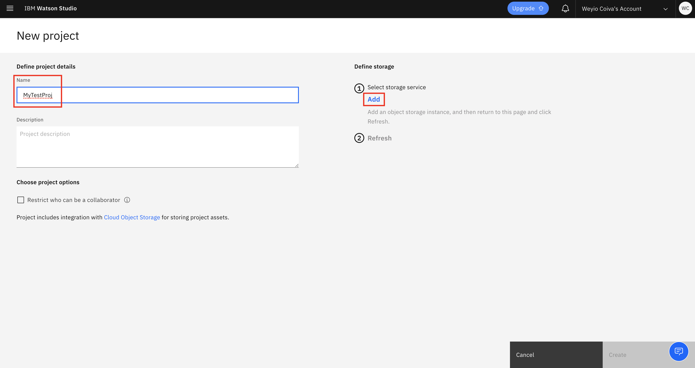

To attach a storage we will create Object Storage service, just scroll down and click Create.

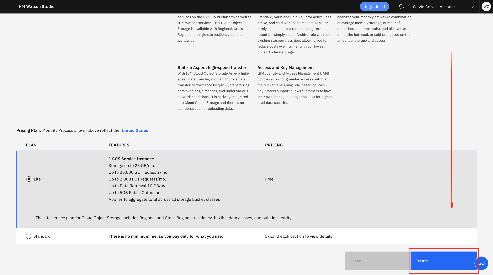

And select confirm.

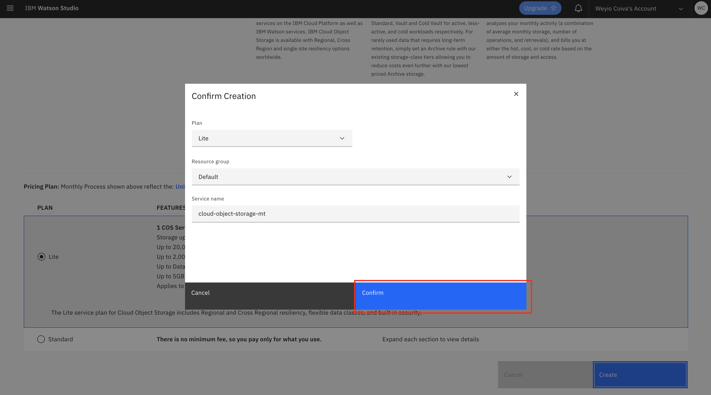

Now your storage is ready to use, click "Refresh" to see it and click "Create"

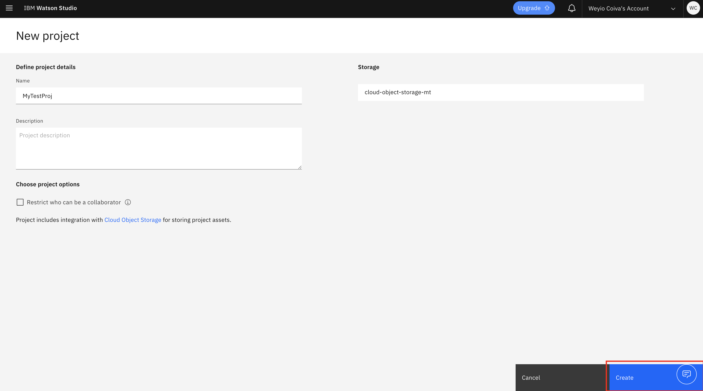

Your project is ready ! now lets add some assets, click on "Add to project".

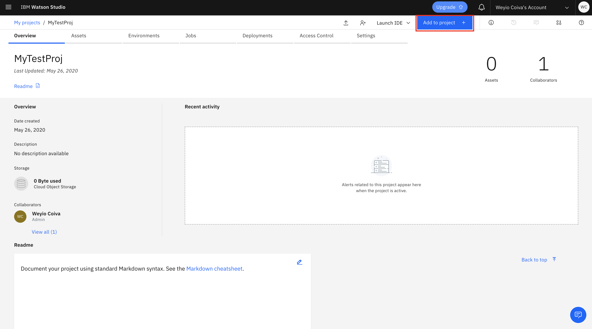

And select "Notebook".

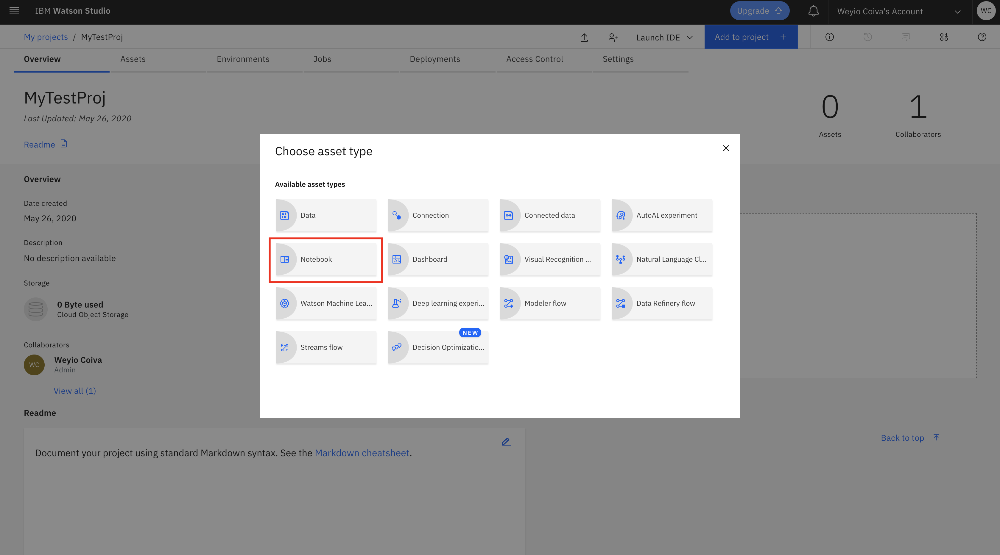

To make it easy we will provide you sample notebook that containe some code already :), just select deploy "From URL" give it a name and use the link to get the Notebook: https://raw.githubusercontent.com/tal2k4xj/Watson-Q-Learning/master/ReinforcementLearningTest.ipynb
After you all set click on "Create"

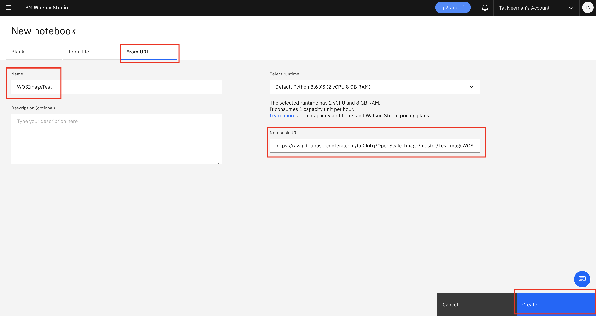

It will take few seconds to upload the Notebook, once its done you can now follow the guide, if you want to run the cells 1 by 1 please clear the output data for your convenient.

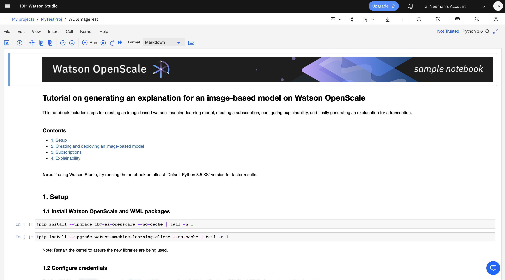

Now you can run the cells and see the results !

#### References 
https://www.learndatasci.com/tutorials/reinforcement-q-learning-scratch-python-openai-gym/